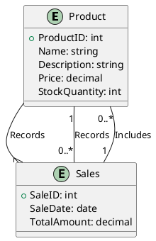

### Step-by-Step Technique

#### 1. **Identify Entities**

- **Entities** are the objects or concepts that have a distinct existence in your domain. For your example, you have two main entities: `Product` and `Sales`.

**Entities:**
- **Product**: Represents items available for sale.
- **Sales**: Represents transactions where products are sold.

#### 2. **Determine Attributes**

- **Attributes** are properties or details of an entity. For each entity, list its relevant attributes.

**Attributes for `Product`:**
- ProductID (Primary Key)
- Name
- Description
- Price
- StockQuantity

**Attributes for `Sales`:**
- SaleID (Primary Key)
- SaleDate
- TotalAmount

#### 3. **Define Relationships**

- **Relationships** describe how entities interact with each other. Identify the interactions between `Product` and `Sales`.

For instance:
- A `Sale` involves one or more `Products`.
- A `Product` can be part of multiple `Sales`.

**Relationship:**
- **Records**: A `Sale` records one or more `Products`.

#### 4. **Define Cardinality**

- **Cardinality** specifies how many instances of one entity can be associated with instances of another entity.

**Cardinality for `Product` and `Sales`:**
- A `Sale` can include multiple `Products`.
- A `Product` can appear in multiple `Sales`.

Thus:
- One `Sale` can involve many `Products`.
- One `Product` can be part of many `Sales`.

#### 5. **Create the Diagram**

You can use PlantUML or other diagram tools. Here’s how to write it in PlantUML:

#### 6. **Review and Adjust**

- **Review** the diagram for accuracy and completeness.
- **Adjust** relationships and cardinalities if necessary.
