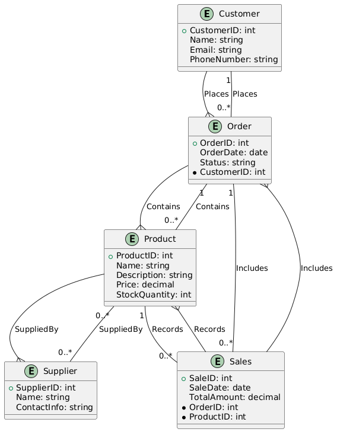

### Step-by-Step Technique to Create an ER Diagram

#### 1. **Identify Entities**

- **Entities** are the objects or concepts with a distinct existence in your domain. In your example, you have five entities: `Customer`, `Order`, `Product`, `Sales`, and `Supplier`.

**Entities:**
- **Customer**: Represents individuals who place orders.
- **Order**: Represents orders placed by customers.
- **Product**: Represents items available for sale.
- **Sales**: Represents transactions where products are sold.
- **Supplier**: Represents entities that supply products.

#### 2. **Determine Attributes**

- **Attributes** are properties or details of an entity. List the relevant attributes for each entity.

**Attributes for `Customer`:**
- CustomerID (Primary Key)
- Name
- Email
- PhoneNumber

**Attributes for `Order`:**
- OrderID (Primary Key)
- OrderDate
- Status
- CustomerID (Foreign Key)

**Attributes for `Product`:**
- ProductID (Primary Key)
- Name
- Description
- Price
- StockQuantity

**Attributes for `Sales`:**
- SaleID (Primary Key)
- SaleDate
- TotalAmount
- OrderID (Foreign Key)
- ProductID (Foreign Key)

**Attributes for `Supplier`:**
- SupplierID (Primary Key)
- Name
- ContactInfo

#### 3. **Define Relationships**

- **Relationships** describe how entities interact with each other.

**Relationships:**
- **Places**: A `Customer` places one or more `Orders`.
- **Contains**: An `Order` can contain multiple `Products`.
- **SuppliedBy**: A `Product` is supplied by one or more `Suppliers`.
- **Includes**: A `Sales` transaction includes one or more `Orders`.
- **Records**: A `Sales` transaction records one or more `Products`.

#### 4. **Define Cardinality**

- **Cardinality** specifies how many instances of one entity can be associated with instances of another entity.

**Cardinality:**
- A `Customer` can place multiple `Orders`.
- An `Order` can contain multiple `Products`.
- A `Product` can be supplied by multiple `Suppliers`.
- A `Sales` transaction can include multiple `Orders` and multiple `Products`.
- A `Product` can be part of multiple `Sales`.

#### 5. **Create the Diagram**

Use PlantUML or another diagram tool. Here's how to write it in PlantUML.

#### 6. **Review and Adjust**

- **Review** the diagram for accuracy and completeness.
- **Adjust** relationships, attributes, and cardinalities if necessary.

