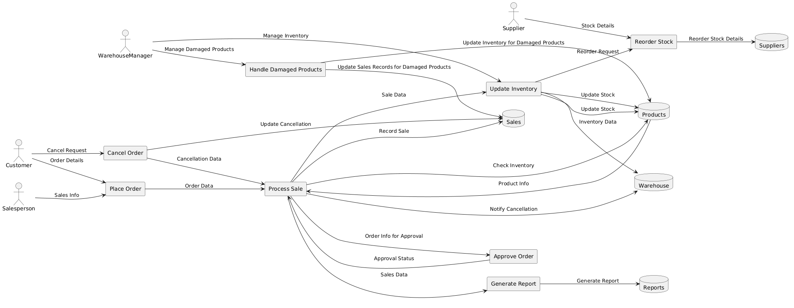

### **Step-by-Step Technique to Create a DFD**

#### **1. Define the Scope and Purpose**
   - **Objective**: Identify the purpose of the DFD. For example, the DFD in the provided diagram outlines a product and sales model.
   - **Scope**: Determine the boundaries of the system. This includes what will be represented within the diagram and what will be excluded.

#### **2. Identify External Entities**
   - **Entities**: These are the sources or destinations of data that interact with the system but are external to it.
   - **Example**: In the diagram, external entities are **Customer**, **Salesperson**, **Supplier**, and **WarehouseManager**.
   - **Placement**: Place these entities on the left side of the DFD.

#### **3. Define Processes**
   - **Processes**: Identify the functions or activities within the system that transform inputs into outputs.
   - **Example**: Processes in the diagram include **Place Order (PO)**, **Process Sale (PS)**, **Update Inventory (UI)**, **Generate Report (GR)**, **Approve Order (AO)**, **Reorder Stock (RS)**, **Cancel Order (CO)**, and **Handle Damaged Products (HDP)**.
   - **Placement**: Position these processes centrally within the DFD.

#### **4. Identify Data Stores**
   - **Data Stores**: Determine where data is stored within the system.
   - **Example**: Data stores in the diagram include **Products**, **Sales**, **Reports**, **Suppliers**, and **Warehouse**.
   - **Placement**: Place data stores within the DFD, typically in the central area or right side.

#### **5. Define Data Flows**
   - **Data Flows**: Identify how data moves between external entities, processes, and data stores. This includes the direction and type of data.
   - **Example**: Data flows in the diagram include:
     - **Customer** to **Place Order (PO)**: "Order Details"
     - **Place Order (PO)** to **Process Sale (PS)**: "Order Data"
     - **Process Sale (PS)** to **Products**: "Check Inventory"
     - **Update Inventory (UI)** to **Products**: "Update Stock"
     - **Process Sale (PS)** to **Generate Report (GR)**: "Sales Data"
     - **Generate Report (GR)** to **Reports**: "Generate Report"
     - **WarehouseManager** to **Handle Damaged Products (HDP)**: "Manage Damaged Products"
     - And many others as shown in the diagram.

#### **6. Map Out Interactions and Data Movement**
   - **Interaction**: Determine how different components of the system interact and the flow of data between them.
   - **Example**: The diagram shows interactions like **Salesperson** providing **Sales Info** to **Place Order (PO)** and **Process Sale (PS)** checking inventory with **Products**.

#### **7. Add Additional Details**
   - **Special Cases**: Include processes for special cases like cancellations or damaged products.
   - **Example**: The diagram includes handling of **Cancel Order (CO)** and **Handle Damaged Products (HDP)**.

#### **8. Review and Validate**
   - **Validation**: Ensure the DFD accurately represents the system and all necessary components are included.
   - **Review**: Check for consistency in data flow, and confirm that all entities, processes, and data stores are correctly represented.

#### **9. Finalize the Diagram**
   - **Refinement**: Make any final adjustments to the layout for clarity.
   - **Documentation**: Ensure the DFD is well-documented with labels and descriptions.

### **Example Diagram Breakdown**

- **External Entities**:
  - **Customer**: Initiates orders and cancellation requests.
  - **Salesperson**: Provides sales information and processes orders.
  - **Supplier**: Provides stock details for reordering.
  - **WarehouseManager**: Manages inventory and damaged products.

- **Processes**:
  - **Place Order (PO)**: Receives and processes orders.
  - **Process Sale (PS)**: Manages the sale process, including inventory checks and recording sales.
  - **Update Inventory (UI)**: Updates stock based on sales and inventory management.
  - **Generate Report (GR)**: Generates sales reports.
  - **Approve Order (AO)**: Approves orders.
  - **Reorder Stock (RS)**: Manages reordering of stock.
  - **Cancel Order (CO)**: Handles order cancellations.
  - **Handle Damaged Products (HDP)**: Manages and updates records for damaged products.

- **Data Stores**:
  - **Products**: Contains product information.
  - **Sales**: Records of sales transactions.
  - **Reports**: Generated sales reports.
  - **Suppliers**: Information on suppliers.
  - **Warehouse**: Data on warehouse inventory.

By following these steps, you can create a clear and effective DFD to represent a product and sales model or any other system.

