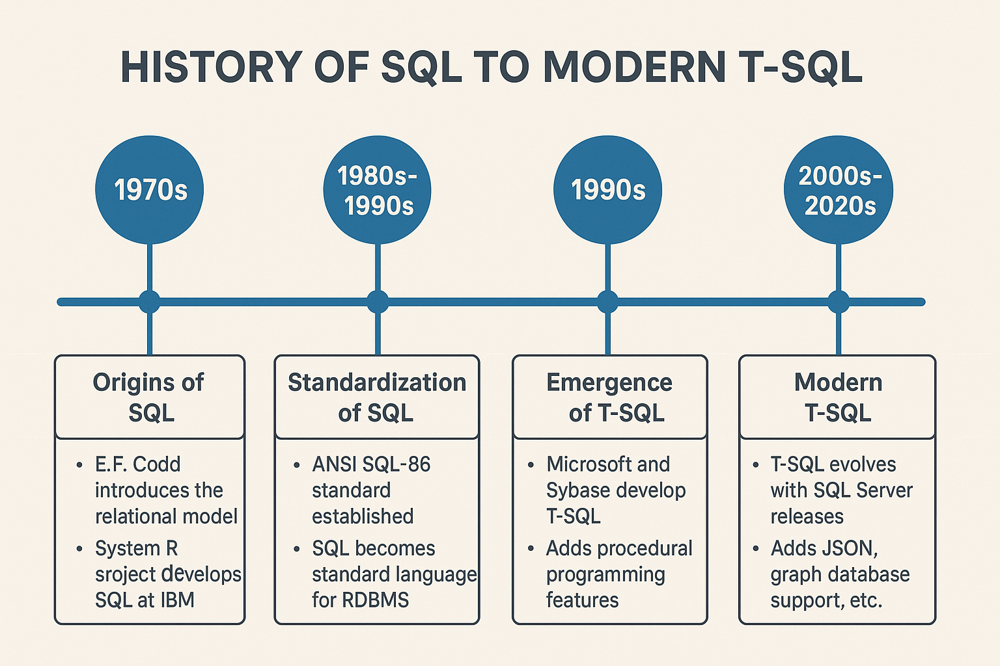

# 001. History of SQL to Modern T-SQL

## What is SQL?

SQL (Structured Query Language) is a domain specific language used to manage data, especially in a relational database management system (RDBMS).

## Why We Need SQL?

SQL is essential because it provides:

1. **Universal Data Access** – Standardized across major database systems (MySQL, PostgreSQL, SQL Server, Oracle)
2. **Data Integrity** – Enforces constraints (e.g., primary keys, foreign keys) to maintain accuracy
3. **Efficient Querying** – Retrieves complex datasets with simple, readable syntax
4. **Scalability** – Handles small datasets to massive enterprise databases
5. **Security** – Role-based permissions protect sensitive data
6. **Integration** – Works with applications, analytics tools, and cloud services
7. **Performance** – Optimized execution through indexing and query planning

## Key Developments

### 1970s: Origins of SQL

, IBM computer scientist who pioneered the relational database model in 1970")

- **E.F. Codd** introduces the relational model (1970)
- IBM’s **System R** project develops **SEQUEL** (later SQL)

### 1980s–1990s: Standardization & Commercialization

- **ANSI SQL-86** – First SQL standard
- Commercial databases adopt SQL (Oracle, DB2, SQL Server)

### 1990s: T-SQL Extensions

Microsoft & Sybase enhance SQL with:

- **Control flow** (`IF...ELSE`, `WHILE`, `BEGIN...END`)
- **Variables & error handling** (`TRY...CATCH`)
- **Stored procedures, triggers, functions**

### 2000s–2020s: Modern SQL

- **JSON/XML** support for semi-structured data
- **Graph database** capabilities
- **Temporal tables** for historical tracking
- **Machine Learning** integration (e.g., SQL Server ML Services)

