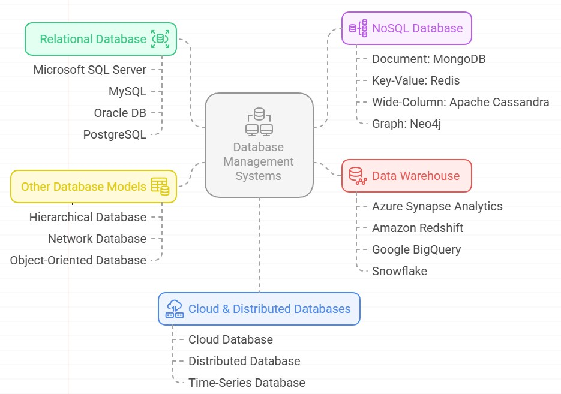
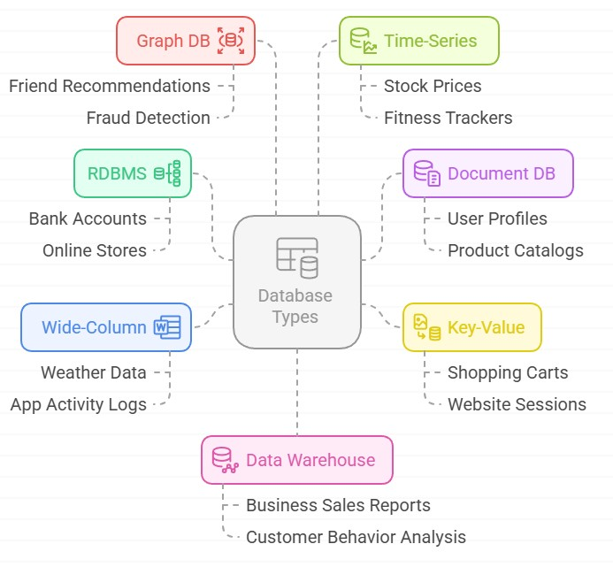

# 002. Getting Started

## Datum

- A datum (plural: data) is a single piece of information. It represents the most basic unit of data.
- Example "42" is a datum representing a person's age.

  | Age |
  | --- |
  | 42  |

## Data

- Raw facts or values stored in a database (e.g., numbers, text, dates).
- Example below

  | Name  | Age | City        |
  | ----- | --- | ----------- |
  | Alice | 30  | New York    |
  | Bob   | 25  | Los Angeles |

## Table

- A collection of rows and columns that stores data about a specific subject, like Customers or Orders.

## Column (Field)

- A named attribute or data category within a table (e.g., Name, Age).

## Row (Record)

- A single entry or instance in a table, representing a single item or entity.

## Database

A database is an organized collection of data that is stored and accessed electronically. Below are the types of database

## SQL (Structured Query Language)

- The standard language for managing and manipulating relational databases using commands like `SELECT`, `INSERT`, `UPDATE`, and `DELETE`.

## T-SQL (Transact-SQL)

- Microsoft's extension to SQL that adds procedural logic (e.g., `IF`, `WHILE`, error handling) and system-level functions.

## Database Management Systems



## Relational Database (RDBMS)

- A database that organizes data into tables which are related to each other via keys.

### Relational Database Example: Online Store

Imagine a database for an online store with four related tables:

#### 1. Customers Table

| CustomerID | Name  | Email                                     |
| ---------- | ----- | ----------------------------------------- |
| 1          | Alice | [alice@email.com](mailto:alice@email.com) |
| 2          | Bob   | [bob@email.com](mailto:bob@email.com)     |

- Primary Key: `CustomerID`

#### 2. Orders Table

| OrderID | CustomerID | OrderDate  |
| ------- | ---------- | ---------- |
| 101     | 1          | 2024-06-10 |
| 102     | 2          | 2024-06-11 |
| 103     | 1          | 2024-06-12 |

- Primary Key: `OrderID`
- Foreign Key: `CustomerID` → links to Customers.CustomerID

#### 3. Products Table

| ProductID | ProductName | Price   |
| --------- | ----------- | ------- |
| P1        | Laptop      | 1000.00 |
| P2        | Phone       | 500.00  |

- Primary Key: `ProductID`

#### 4. OrderDetails Table (to link Orders to Products)

| OrderID | ProductID | Quantity |
| ------- | --------- | -------- |
| 101     | P1        | 1        |
| 101     | P2        | 2        |
| 102     | P2        | 1        |

- Composite Primary Key: (`OrderID`, `ProductID`)
- Foreign Keys:

  - `OrderID` → Orders
  - `ProductID` → Products

#### How It's "Relational"

- `Orders` is related to `Customers` via `CustomerID`
- `OrderDetails` is related to `Orders` and `Products`
- You can JOIN these tables in SQL to answer questions like:

  > “What products did Alice order on June 10?”

 for the online store")

## Relational Database (RDBMS) Solutions

### Microsoft SQL Server

A robust RDBMS by Microsoft, offering enterprise-grade features, scalability, and integration with Windows ecosystems. Widely used in business applications and data analytics.

- [Official Site](https://www.microsoft.com/en-us/sql-server)

### MySQL

An open-source RDBMS known for its speed, reliability, and ease of use. Powers many web applications, including WordPress, and is a popular choice for startups.

- [Official Site](https://www.mysql.com/)
- [Documentation](https://dev.mysql.com/doc/)

### Oracle DB

A high-performance, scalable RDBMS designed for large enterprises. Offers advanced features like partitioning, Real Application Clusters (RAC), and strong security controls.

- [Official Site](https://www.oracle.com/database/)
- [Documentation](https://docs.oracle.com/en/database/)

### PostgreSQL

An advanced open-source RDBMS with support for JSON, geospatial data, and custom extensions. Known for its standards compliance and extensibility.

- [Official Site](https://www.postgresql.org/)
- [Documentation](https://www.postgresql.org/docs/)

## NoSQL Database Solutions

NoSQL databases provide flexible schemas, horizontal scalability, and optimized performance for unstructured or semi-structured data.

### Document: MongoDB

A document-oriented NoSQL database storing data in JSON-like formats. Ideal for agile development, real-time analytics, and handling dynamic schemas.

- [Official Site](https://www.mongodb.com/)
- [MongoDB Atlas](https://www.mongodb.com/atlas/database)

### Key-Value: Redis

An in-memory key-value store with sub-millisecond latency. Used for caching, session management, and real-time applications like leaderboards.

- [Official Site](https://redis.io/)
- [Documentation](https://redis.io/docs/)

### Wide-Column: Apache Cassandra

A distributed NoSQL database designed for high availability and linear scalability. Suited for time-series data, IoT, and applications requiring fault tolerance.

- [Official Site](https://cassandra.apache.org/)
- [Documentation](https://cassandra.apache.org/doc/latest/)

### Graph: Neo4j

A graph database optimized for managing highly connected data. Used in fraud detection, recommendation engines, and social network analysis.

- [Official Site](https://neo4j.com/)
- [Documentation](https://neo4j.com/docs/)

## Other Database Models

### Hierarchical Database

Organizes data in a tree-like structure, best suited for systems with parent-child relationships (e.g., file systems, IBM IMS).

- [Wikipedia](https://en.wikipedia.org/wiki/Hierarchical_database_model)
- [IBM IMS](https://www.ibm.com/products/information-management-system)

### Network Database

Extends hierarchical models with many-to-many relationships, following the CODASYL standard. Rarely used today but foundational in early database systems.

- [Wikipedia](https://en.wikipedia.org/wiki/Network_model)
- [CODASYL Model](https://en.wikipedia.org/wiki/CODASYL)

### Object-Oriented Database

Stores data as objects, supporting inheritance and polymorphism. Used in complex domains like CAD/CAM and scientific applications.

- [Wikipedia](https://en.wikipedia.org/wiki/Object-oriented_database)
- [ObjectDB](https://www.objectdb.com/)

## Cloud & Distributed Databases

### Cloud Database

Fully managed database services (e.g., Amazon RDS, Azure SQL) offering scalability, backups, and high availability without infrastructure overhead.

- [Azure SQL Database](https://azure.microsoft.com/en-us/products/azure-sql/)
- [Amazon RDS](https://aws.amazon.com/rds/)
- [Google Cloud SQL](https://cloud.google.com/sql)

### Distributed Database

Spreads data across multiple nodes for fault tolerance and scalability (e.g., Google Spanner, Cassandra). Ensures consistency and availability in global systems.

- [Wikipedia](https://en.wikipedia.org/wiki/Distributed_database)
- [Google Cloud Spanner](https://cloud.google.com/spanner)
- [Apache Cassandra](https://cassandra.apache.org/)

### Time-Series Database

Optimized for timestamped data (e.g., IoT, monitoring). InfluxDB and TimescaleDB enable efficient storage and querying of time-based metrics.

- [InfluxDB](https://www.influxdata.com/)
- [TimescaleDB](https://www.timescale.com/)

## Data Warehouse

Centralized repositories for analytical reporting, integrating data from multiple sources.

### Solutions

- [Azure Synapse Analytics][synapse] Unified analytics with big data and SQL integration.

- [Amazon Redshift][redshift] Cloud-based data warehousing with columnar storage.

- [Google BigQuery][bigquery] Serverless, scalable analytics with SQL support.

- [Snowflake][snowflake] Multi-cloud data warehousing with separation of storage and compute.

[synapse]: https://azure.microsoft.com/en-us/products/synapse-analytics/
[redshift]: https://aws.amazon.com/redshift/
[bigquery]: https://cloud.google.com/bigquery
[snowflake]: https://www.snowflake.com/

## When to Use Which Database?



### Real World Pizza Shop Example

- Customer database → RDBMS (MySQL)
- Menu items → Document DB (MongoDB)
- Current orders → Key-Value (Redis)
- Delivery routes → Graph DB (Neo4j)
- Oven temperatures → Time-Series (InfluxDB)
- Sales reports → Data Warehouse (BigQuery)

## Data Types in T-SQL

### 1. Exact Numeric Data Types

- **INT**: 4 bytes (-2^31 to 2^31-1) or -2,147,483,648 to 2,147,483,647  
  _Use for whole numbers like counts, IDs, or any integer value within this range._

  ```sql
  DECLARE @ProductCount INT = 1000;
  ```

- **BIGINT**: 8 bytes (-2^63 to 2^63-1) or -9,223,372,036,854,775,808 to 9,223,372,036,854,775,807  
  _Use for very large whole numbers like global inventory counts or scientific calculations._

  ```sql
  DECLARE @GlobalInventory BIGINT = 9223372036854775807;
  ```

- **SMALLINT**: 2 bytes (-2^15 to 2^15-1) or -32,768 to 32,767  
  _Use for smaller whole numbers to save space when range is known to be limited._

  ```sql
  DECLARE @WarehouseCount SMALLINT = 200;
  ```

- **TINYINT**: 1 byte (0 to 2^8-1) or 0 to 255  
  _Use for very small non-negative numbers like ratings, small quantities, or status codes._

  ```sql
  DECLARE @Rating TINYINT = 5;
  ```

- **DECIMAL/NUMERIC**: Precision 1-38 (storage varies)  
  _Use for exact decimal numbers like monetary values where precision is critical (e.g., DECIMAL(10,2) for currency)._
  ```sql
  DECLARE @ExactPrice DECIMAL(10,2) = 199.99;
  ```

### 2. Approximate Numeric Data Types

- **FLOAT**: 4 or 8 bytes (±1.79E+308)  
  _Use for scientific calculations where approximate values are acceptable. Avoid for financial calculations._

  ```sql
  DECLARE @ScientificValue FLOAT = 2.5E-20;
  ```

- **REAL**: 4 bytes (±3.40E+38)  
  _Use for floating-point numbers when storage space is critical and precision can be sacrificed._
  ```sql
  DECLARE @ApproxValue REAL = 1.23456;
  ```

### 3. Monetary Data Types

- **MONEY**: 8 bytes (-2^63/10000 to 2^63-1/10000) or -922,337,203,685,477.5808 to 922,337,203,685,477.5807  
  _Use for currency values. Provides better accuracy for financial calculations than FLOAT/REAL._

  ```sql
  DECLARE @TotalAmount MONEY = 999999.99;
  ```

- **SMALLMONEY**: 4 bytes (-214,748.3648 to 214,748.3647)  
  _Use for smaller currency values when storage space is a concern._
  ```sql
  DECLARE @ItemPrice SMALLMONEY = 199.99;
  ```

### 4. Date and Time Data Types

- **DATE**: 3 bytes (0001-01-01 to 9999-12-31)  
  _Use when only the date component is needed (no time). Most efficient for pure date storage._

  ```sql
  DECLARE @OrderDate DATE = '2023-11-15';
  ```

- **TIME**: 3-5 bytes (00:00:00.0000000 to 23:59:59.9999999)  
  _Use when only the time component is needed (no date). Precision can be specified._

  ```sql
  DECLARE @ShipTime TIME = '14:30:00.1234567';
  ```

- **DATETIME**: 8 bytes (1753-01-01 to 9999-12-31, 3.33ms accuracy)  
  _Legacy type - prefer DATETIME2 for new development. Compatible with older systems._

  ```sql
  DECLARE @Created DATETIME = '2023-11-15 09:30:25';
  ```

- **DATETIME2**: 6-8 bytes (0001-01-01 to 9999-12-31, 100ns accuracy)  
  _Modern replacement for DATETIME. Allows precision specification (e.g., DATETIME2(7) for maximum precision)._

  ```sql
  DECLARE @Updated DATETIME2(7) = '2023-11-15 09:30:25.1234567';
  ```

- **SMALLDATETIME**: 4 bytes (1900-01-01 to 2079-06-06, 1 minute accuracy)  
  _Use when space is critical and minute precision is sufficient._
  ```sql
  DECLARE @PromoEnd SMALLDATETIME = '2023-12-31 23:59';
  ```

### 5. Character and Unicode Data Types

- **CHAR/VARCHAR**: 1 byte per character (VARCHAR(MAX) up to 2^31-1 bytes)  
  _CHAR for fixed-length strings (e.g., codes), VARCHAR for variable-length. Use VARCHAR(MAX) for very large text._

  ```sql
  DECLARE @SKU CHAR(10) = 'PROD12345';
  DECLARE @Description VARCHAR(500) = 'High-quality product description';
  ```

- **NCHAR/NVARCHAR**: 2 bytes per character (NVARCHAR(MAX) up to 2^30-1 characters)  
  _Use for Unicode text (international characters). NVARCHAR is preferred over VARCHAR unless ASCII-only is guaranteed._
  ```sql
  DECLARE @ProductName NVARCHAR(100) = N'Produit de qualité supérieure';
  ```

### 6. Binary Data Types

- **BINARY/VARBINARY**: Up to VARBINARY(MAX) with 2^31-1 bytes  
  _Use for storing binary data like images, files, or serialized objects._
  ```sql
  DECLARE @ProductImage VARBINARY(MAX) = 0x89504E470D0A1A0A...;
  ```

### 7. Special Data Types

- **BIT**: 1 bit (0, 1, or NULL)  
  _Use for boolean values (true/false). Storage optimized - multiple BIT columns are packed together._

  ```sql
  DECLARE @InStock BIT = 1;
  ```

- **UNIQUEIDENTIFIER**: 16 bytes (GUID)  
  _Use for globally unique identifiers. Larger than INT/BIGINT but guaranteed unique across systems._

  ```sql
  DECLARE @CartID UNIQUEIDENTIFIER = NEWID();
  ```

- **XML**: Up to 2GB  
  _Use for storing and querying XML data. Provides XML-specific methods for querying._

  ```sql
  DECLARE @ProductSpecs XML = '<specs><weight>1.2kg</weight><dimensions>10x20x30cm</dimensions></specs>';
  ```

- **JSON**: Stored as NVARCHAR  
  _Use for JSON data (SQL Server 2016+). Provides JSON-specific functions for querying._
  ```sql
  DECLARE @ProductJSON NVARCHAR(MAX) = '{"id":123,"name":"Widget","price":19.99,"colors":["red","blue"]}';
  ```

### Shopping Cart Table Example

```sql
-- Create a new table named 'ShoppingCart' to store shopping cart information
CREATE TABLE ShoppingCart (
    -- A unique identifier for each cart item, automatically generated if not provided
    -- PRIMARY KEY means this uniquely identifies each row in the table
    -- NEWID() generates a new random unique identifier
    CartID UNIQUEIDENTIFIER PRIMARY KEY DEFAULT NEWID(),

    -- Stores the ID of the user who owns this cart item
    -- BIGINT is a large integer type (can store very big numbers)
    -- NOT NULL means this field must always have a value
    UserID BIGINT NOT NULL,

    -- Stores a session identifier (for users who aren't logged in)
    -- VARCHAR(64) means a text field up to 64 characters long
    SessionID VARCHAR(64) NOT NULL,

    -- Stores the ID of the product in this cart item
    -- INT is an integer type (whole numbers)
    ProductID INT NOT NULL,

    -- Stock Keeping Unit - a unique identifier for product variations
    -- CHAR(12) means exactly 12 characters (fixed length)
    SKU CHAR(12) NOT NULL,

    -- The name of the product (up to 100 characters)
    -- NVARCHAR supports international characters
    ProductName NVARCHAR(100) NOT NULL,

    -- Detailed description of the product (unlimited length)
    -- NVARCHAR(MAX) can store very large amounts of text
    ProductDescription NVARCHAR(MAX),

    -- How many of this product are in the cart
    -- SMALLINT is a small integer (range -32,768 to 32,767)
    -- DEFAULT 1 means if not specified, it will be set to 1
    Quantity SMALLINT NOT NULL DEFAULT 1,

    -- The price of one unit of this product
    -- MONEY is a data type for currency values
    UnitPrice MONEY NOT NULL,

    -- Any discount applied to this product
    -- SMALLMONEY is like MONEY but with smaller range
    -- DEFAULT 0.00 means if not specified, no discount is applied
    DiscountAmount SMALLMONEY DEFAULT 0.00,

    -- A calculated field that shows total price for this line item
    -- (quantity × unit price) minus any discount
    -- This value is computed automatically and not stored
    TotalPrice AS (Quantity * UnitPrice - DiscountAmount),

    -- Whether this item should be gift wrapped (1 = yes, 0 = no)
    -- BIT is like a boolean (can be 0 or 1)
    IsGiftWrapped BIT DEFAULT 0,

    -- Cost for gift wrapping (up to 999.99 with 2 decimal places)
    -- DECIMAL(5,2) means 5 total digits with 2 after decimal point
    -- NULL means this can be empty if no gift wrap is selected
    GiftWrapPrice DECIMAL(5,2) NULL,

    -- Stores the product image as binary data
    -- VARBINARY(MAX) can store large binary files like images
    ProductImage VARBINARY(MAX),

    -- Stores product specifications in XML format
    -- XML is a structured data format
    ProductSpecs XML,

    -- Stores additional product attributes in JSON format
    -- JSON is a popular data interchange format
    ProductAttributes JSON,

    -- When this item was added to the cart
    -- DATETIME2 stores date and time with high precision
    -- SYSDATETIME() gets the current date and time
    DateAdded DATETIME2 DEFAULT SYSDATETIME(),

    -- When this cart item was last modified
    LastUpdated DATETIME2 DEFAULT SYSDATETIME(),

    -- When this cart item should expire/be removed
    -- DATE stores just the date (no time)
    ExpiryDate DATE,

    -- Whether this cart item is active (1) or inactive (0)
    -- DEFAULT 1 means items are active by default
    IsActive BIT DEFAULT 1,

    -- Any additional notes about this cart item
    -- VARCHAR(500) means text up to 500 characters
    Notes VARCHAR(500),

    -- Creates a foreign key relationship to the Users table
    -- This ensures the UserID exists in the Users table
    CONSTRAINT FK_UserID FOREIGN KEY (UserID) REFERENCES Users(UserID),

    -- Creates a foreign key relationship to the Products table
    -- This ensures the ProductID exists in the Products table
    CONSTRAINT FK_ProductID FOREIGN KEY (ProductID) REFERENCES Products(ProductID),

    -- Adds a check constraint to ensure quantity is always positive
    CONSTRAINT CHK_Quantity CHECK (Quantity > 0),

    -- Adds a check constraint to ensure prices are never negative
    CONSTRAINT CHK_Price CHECK (UnitPrice >= 0 AND DiscountAmount >= 0)
);

-- Creates an index on the UserID column to speed up searches by user
-- Indexes help the database find data faster
CREATE INDEX IX_ShoppingCart_UserID ON ShoppingCart(UserID);

-- Creates an index on the SessionID column to speed up searches by session
CREATE INDEX IX_ShoppingCart_SessionID ON ShoppingCart(SessionID);
```

#### Key concepts explained:

1. Data types (INT, VARCHAR, MONEY, BIT, etc.) define what kind of data each column holds
2. Constraints (PRIMARY KEY, FOREIGN KEY, CHECK) enforce data integrity rules
3. DEFAULT values are used when no value is provided
4. NOT NULL means the field is required
5. NULL means the field is optional
6. Indexes improve query performance
7. Computed columns (like TotalPrice) are calculated automatically

### General Notes:

1. Always choose the smallest data type that will accommodate your data to optimize storage and performance.
2. For monetary values, prefer DECIMAL or MONEY types over FLOAT/REAL to avoid rounding errors.
3. For new development, prefer DATETIME2 over DATETIME for better precision and range.
4. Use NVARCHAR instead of VARCHAR when international character support might be needed.
5. Consider using computed columns (like TotalPrice) for derived values to maintain data integrity.
6. For large binary data, consider storing file paths in the database and the actual files in a filesystem or blob storage.
